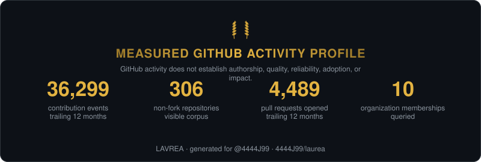
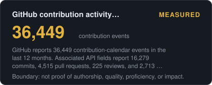
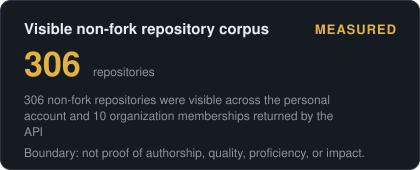
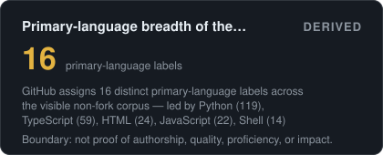

# LAVREA — evidence-bearing achievement intelligence

LAVREA is the durable achievement and distinction layer for **@4444J99**: measure the work, identify reproducible distinctions and externally validated achievements, preserve provenance, and render the strongest defensible case without allowing later context loss to erase previously established distinctions.

<p align="center">
  
</p>

<p align="center">
  
  
</p>
<p align="center">
  
  
</p>

## Why this repository exists

This is not merely a GitHub-stat card generator. Its job is to answer:

**What is measurably distinctive, externally validated, or demonstrably exceptional about this body of work—and what evidence makes that claim survive scrutiny?**

Start with the [Achievement Ledger](ACHIEVEMENTS.md). The generated API snapshot remains in [PROFILE.md](assets/PROFILE.md), and field definitions remain in [METHODOLOGY.md](METHODOLOGY.md).

The ledger deliberately distinguishes direct measurements, reproducible derived distinctions, and externally attributed distinctions. That means an old percentile implementation can be withdrawn without rewriting history: a recruiter-originated finding remains a recruiter-originated finding until its original evidence is recovered or contradicted.

## Current measured surface

The latest checked snapshot records **33,587 GitHub contribution events**, **15,671 commits**, **4,191 pull requests opened**, **290 visible non-fork repositories**, **17 primary-language labels**, and **109 Python-primary repositories** in the visible corpus.

These numbers are intentionally named precisely. Contributions are not commits; repository visibility is not authorship; volume is not quality. Precision makes the measurements easier to assess and the verified achievements harder to dismiss.

The ledger also records three independently verifiable upstream merges in **FastMCP**, **Datadog GuardDog**, and the **Temporal Python SDK**, each with pull-request and merge evidence.

## The arena

An issue titled `arena: your-login` asks CI to compute the same bounded fields for another public account and update [LEADERBOARD.md](LEADERBOARD.md). The table orders rows by activity count for navigation; it is not, by itself, a quality ranking.

## Run it on yourself

1. Use the repository as a template or fork it.
2. Enable Actions. The canonical `organvm/laurea` repository tracks `4444J99`; a personal copy defaults to its repository owner. An organization-owned copy must set `LAUREA_LOGIN`.
3. Optionally add a `LAUREA_TOKEN` secret for restricted contribution counts and private organization visibility.
4. Embed a generated card.

```bash
pip install -e '.[test]'
laurea run --login YOUR_LOGIN
laurea axes
python -m pytest tests -q
```

LAVREA has zero runtime dependencies. Every observation must name its source field or deterministic transformation and state its interpretive boundary.

## License

MIT.
